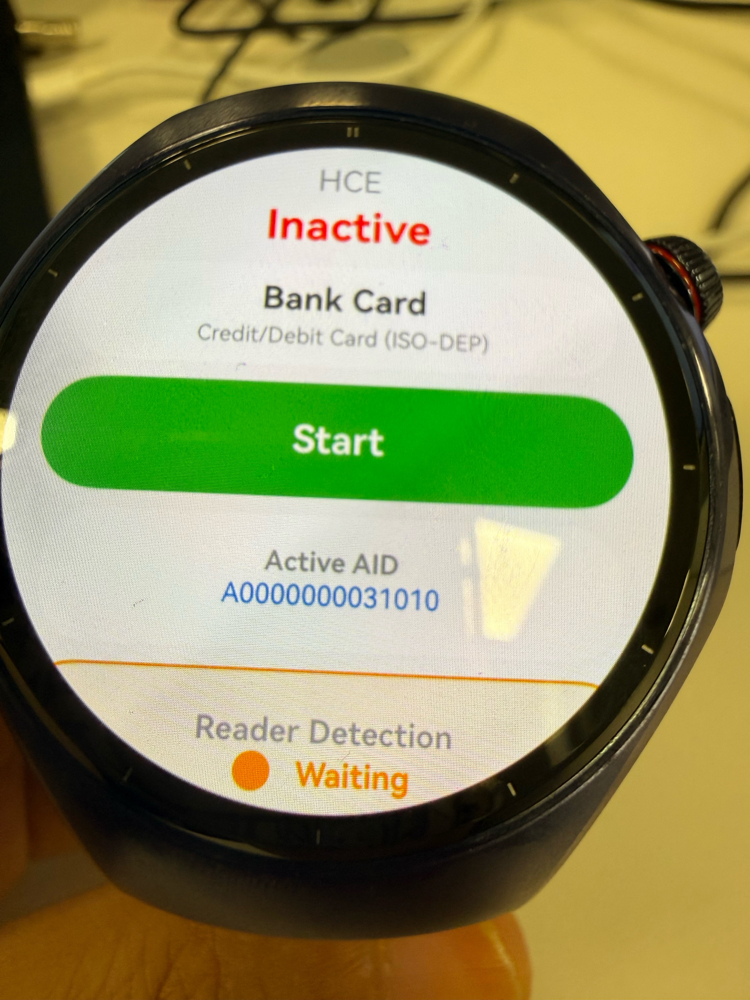
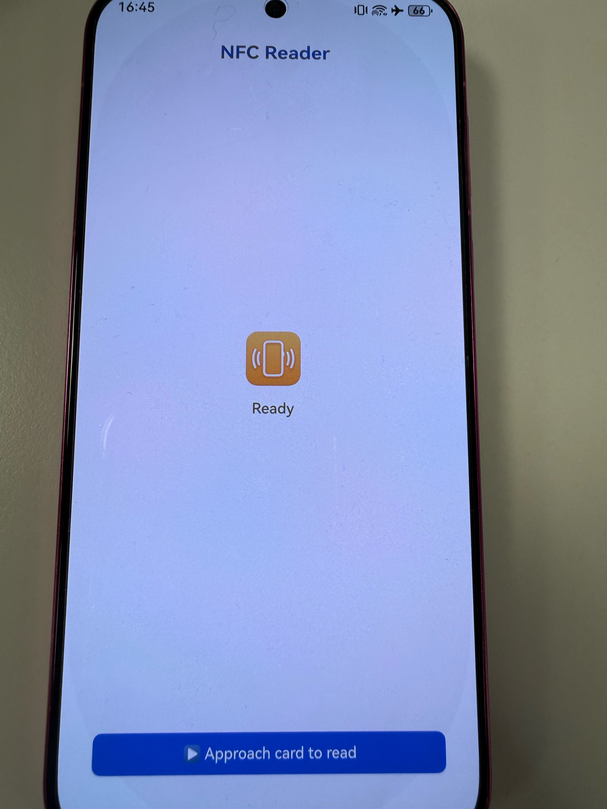
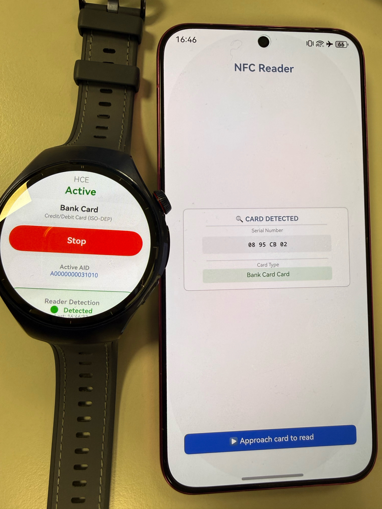

# NFC Demo Project

## Project Overview

This is a HarmonyOS NFC demonstration application project that implements NFC card read/write, Host Card Emulation (HCE), vibration feedback, and other features. The project adopts a multi-module architecture, divided into a main application module and a storage service module.

## Screenshots
  
  
  

## Project Structure

```
nfc_demo/
├── entry/                          # Main application module (app entry point)
│   ├── src/main/
│   │   ├── ets/                   # ETS source code
│   │   │   ├── entryability/      # Application entry Ability
│   │   │   ├── entrybackupability/# Backup Ability
│   │   │   └── pages/             # UI pages (Index.ets)
│   │   ├── module.json5           # Module configuration file
│   │   └── resources/             # Application resources
│   ├── build/                     # Build output directory
│   ├── oh-package.json5           # Module dependency configuration
│   └── build-profile.json5        # Build configuration
│
├── save/                           # Storage service module (background service)
│   ├── src/main/
│   │   ├── ets/                   # ETS source code
│   │   │   ├── saveability/       # Save Ability
│   │   │   ├── savebackupability/ # Backup Ability
│   │   │   ├── models/            # Data models
│   │   │   │   └── Card.ets       # Card data model
│   │   │   ├── services/          # Background services
│   │   │   │   ├── CardStorageService.ets    # Card storage service
│   │   │   │   ├── HCEService.ets            # HCE (Host Card Emulation) service
│   │   │   │   └── NFCReaderService.ets      # NFC reader service
│   │   │   └── pages/             # UI pages
│   │   └── module.json5           # Module configuration file
│   ├── build/                     # Build output directory
│   └── oh-package.json5           # Module dependency configuration
│
├── AppScope/                       # Global resources
│   ├── app.json5                  # Application global configuration
│   └── resources/                 # Application resource files
│
├── oh_modules/                    # Third-party module libraries
│   └── @ohos/                     # HarmonyOS official modules
│       ├── hamock/                # Mock framework
│       └── hypium/                # Unit testing framework
│
├── hvigor/                        # Hvigor build system configuration
│   └── hvigor-config.json5
│
├── hvigorfile.ts                  # Global build script
├── oh-package.json5               # Global dependency configuration
├── local.properties               # Local configuration properties
├── syscap.json                    # System capability configuration
└── Configuration files
    ├── code-linter.json5          # Code linting configuration
    └── build-profile.json5        # Build configuration
```

## Core Feature Modules

### 1. Main Application Module (entry)
- **Entry Point**: `EntryAbility` - Application startup and initialization
- **Backup**: `EntryBackupAbility` - Data backup capability
- **Pages**: `Index.ets` - Main user interface
- **Features**: Provides UI for NFC card read/write, scanning, and management

### 2. Storage Service Module (save)
Background service module responsible for data persistence and NFC communication.

#### Data Models
- **Card.ets**: Card data structure definition
  - Card ID, name, description
  - NFC tag UID, type
  - Other metadata

#### Core Services
- **CardStorageService.ets** - Card data storage and management
  - Save/delete/update card information
  - Local database operations
  - Cache management

- **HCEService.ets** - Host Card Emulation service
  - Emulate NFC cards
  - Handle APDU commands
  - Support contactless payment and data exchange

- **NFCReaderService.ets** - NFC reader service
  - Detect NFC reader devices
  - Read NFC card information
  - Handle NFC events
  - Vibration feedback control

## Key Features

- ✅ **NFC Card Read/Write** - Support reading and writing NFC tags
- ✅ **Host Card Emulation (HCE)** - Device can act as an NFC card
- ✅ **NFC Reader Detection** - Detect external NFC reader devices
- ✅ **Vibration Feedback** - Vibration feedback on user interactions
- ✅ **Card Storage Management** - Local card information management
- ✅ **Background Service** - SaveAbility provides background service capability
- ✅ **Data Backup** - EntryBackupAbility and SaveBackupAbility support data backup

## Build and Deployment

### Requirements
- HarmonyOS SDK (latest version)
- DevEco Studio or VS Code
- Hvigor build tool

### Building the Project
```bash
# Build the project
hvigorw build

# Build for release
hvigorw build -m release
```

### Deploying to Device
```bash
# Deploy via DevEco Studio
# Or use command line
hvigorw install
```

## Configuration Files

| File | Description |
|------|-------------|
| `oh-package.json5` | Global dependencies and version management |
| `hvigorfile.ts` | Global build script configuration |
| `syscap.json` | System capability declaration |
| `code-linter.json5` | Code linting rules |
| `local.properties` | Local development environment configuration |

## Key APIs and Services

### NFC Related
- HarmonyOS NFC Framework
- Host Card Emulation API
- NFC Reader/Writer API

### Storage Related
- RelationalDatabase (Relational database)
- PersistentStorage (Persistent storage)

### Others
- Vibrator API (Vibration)
- Window API (Window management)
- Ability Framework (Application framework)

## Development Guide

### Adding New Features
1. Create new TS/ETS files in the `ets/` directory of the corresponding module
2. Update the module's `module.json5` configuration
3. Import and use the new feature in the main application

### Modifying UI
Edit `entry/src/main/ets/pages/Index.ets` to update the main interface

### Extending Background Services
Add new service classes in the `save/src/main/ets/services/` directory

## Troubleshooting

### Build Errors
- Verify `local.properties` configuration is correct
- Ensure HarmonyOS SDK is properly installed
- Clean build directory and rebuild

### NFC Features Not Working
- Confirm device supports NFC functionality
- Check application permission configuration
- Verify HCEService and NFCReaderService are running

### Vibration Feedback Issues
- Confirm device has vibration motor support
- Check Vibrator API permissions

## License

This project is licensed under the Apache License 2.0. See the [LICENSE](LICENSE) file for details.

## Contributing

Contributions are welcome! Please feel free to submit issues and pull requests.

## Support

For questions or suggestions, please open an issue on the project repository.